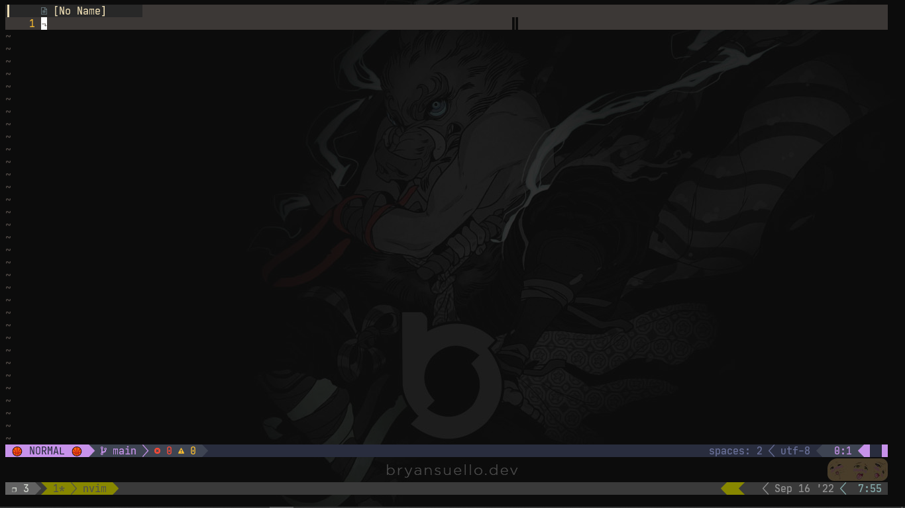

- prettier and eslint npm -g
- configure .eslintrc.json

#### local: 
  * formatting.prettier - npm
  * formatting.stylua - npm
  * diagnostics.eslint - npm
  * diagnostics.alex -npm or zypper?
  * diagnostics.cspell - npm
  * diagnostics.tidy - zypper/apt
  * stylelint - npm
  * stylua - cargo(if sumneko_lua lsp is not working)

#### todo comments types:

<!-- TODO: -->
<!-- FIX: -->
<!-- WARN: -->
<!-- NOTE: -->

- don't use
  <!-- PERF: -->
  <!-- HACK: -->

* alex lsp w the suggestions writing mds.
